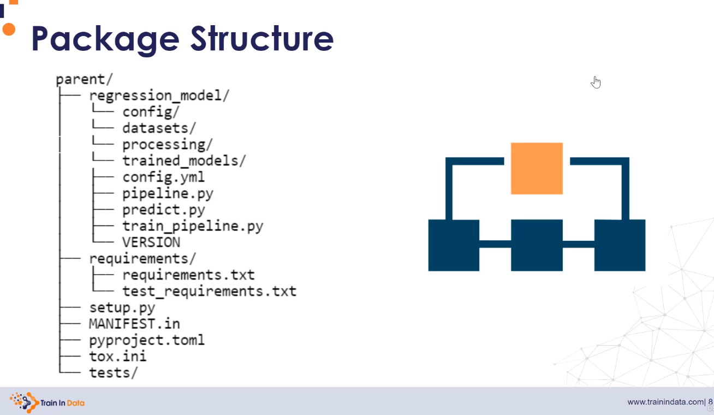
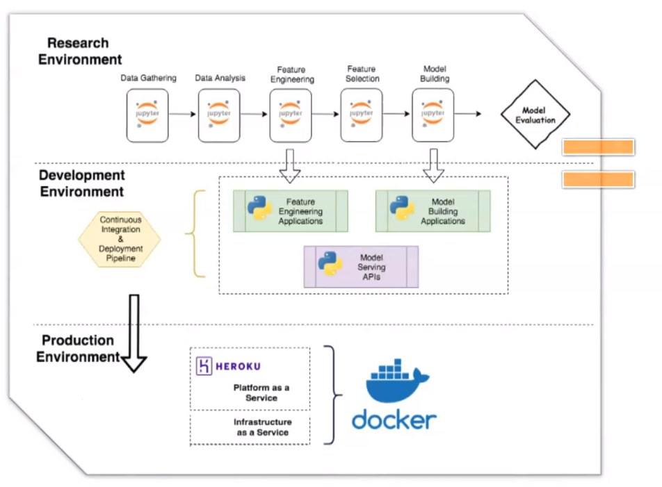

 
  

<h1 align="center"> Diabetis Predictor </h1>
<h3 align="center"> Python Developer Capstone 1</h3>
<h5 align="center"> Python Developer Career Training Course <a href="https://www.nwmissouri.edu/pdcenter/courses/python-developer.htm">Northwest Missouri State University</a>  (2024) </h5>

 

I have built a Supervised Learning Classification model to predict the probabilty of diabetis given age and physical activity data.  Will be using Python to feed data into my Machine Learning model to obtain my diabetes prediction.

<h2>Workflow: </h2>
<ul>
   
  <li>
Frame my Hypothesis: 

      
Increase exercise and healthier eating habits can lessen the probabilty of developing diabetes for all ages

  </li>
  <li>
Prepare my data

      
 Jupyter Notebook

  </li>
  <li>
Anyalyze using visuals

      
 Jupyter Notebook

  </li>
  <li>
Make an interpretation 

      
 Jupyter Notebook

  </li>
  <li>
Communicate my results 

      
 Jupyter Notebook

      
 

  </li>
  <li>
Build my app

      
 Pycharm:  transfer jupyter notebook ipynb files to py files
      
 Pycharm:  Make visuals interactive by converting them Dash Plotly 

      
 Pycharm: Launch app to render.com 

      
  </li>
</ul>

<h2>References</h2>
<ul>
   
  <li>
Design Inspiration, Author:Mohammad Amin Shamshiri 

      
link: https://raw.githubusercontent.com/yourexodus/Spam-Detector/master/README.md

  </li>
  <li>
 

      
link:  

  </li>
  <li>
Gemini - Used AI to generate cat Images and to learn How to deploy my Prediction model

      
link:  https://gemini.google.com

  </li>
  <li>
Canva,  create my gif file using my cat images from Gemini

      
link: https://www.canva.com 

  </li>
  <li>
Udemy.com - Online course 

      
course:How to use ChatGPT and Generative AI to help create content

      
course:Deployment of Machine Learning Models

      
      
  
  </li>
  <li>
 

      
 

  </li>
</ul>
 
<table>
  <thead>
    <tr>
      <th>Data: Education Level codes:</th>
    </tr>
  </thead>
  <tbody>
    <tr>
      <td>1 Never attended school or only kindergarten</td>
    </tr>
    <tr>
      <td>2 Grades 1 through 8 (Elementary)</td>
    </tr>
    <tr>
      <td>3 Grades 9 through 11 (Some high school)</td>
    </tr>
    <tr>
      <td>4 Grade 12 or GED (High school graduate)</td>
    </tr>
    <tr>
      <td>5 College 1 year to 3 years (Some college or technical school)</td>
    </tr>
    <tr>
      <td>6 College 4 years or more (College graduate)</td>
    </tr>
    <tr>
      <td>9 Refused</td>
    </tr>
    <tr>
      <td>BLANK Not asked or Missing 1,770</td>
    </tr>
  </tbody>
</table>

<table>
  <thead>
    <tr>
      <th>General Health Codes</th>
    </tr>
  </thead>
  <tbody>
    <tr>
      <td>1 Excellent</td>
    </tr>
    <tr>
      <td>2 Very good</td>
    </tr>
    <tr>
      <td>3 Good</td>
    </tr>
    <tr>
      <td>4 Fair</td>
    </tr>
    <tr>
      <td>5 Poor</td>
    </tr>
    <tr>
      <td>7 Don’t know/Not Sure</td>
    </tr>
    <tr>
      <td>9 Refused</td>
    </tr>
    <tr>
      <td>&nbsp;</td>
    </tr>
  </tbody>
</table>

<table>
  <thead>
    <tr>
      <th>Mental health code</th>
    </tr>
  </thead>
  <tbody>
    <tr>
      <td>1 - 30 Number of days</td>
    </tr>
    <tr>
      <td>88 None</td>
    </tr>
    <tr>
      <td>77 Don’t know/Not sure</td>
    </tr>
    <tr>
      <td>99 Refused</td>
    </tr>
    <tr>
      <td>&nbsp;</td>
    </tr>
  </tbody>
</table>
<table>
  <thead>
    <tr>
      <th>Difficulty Walking or Climbing Stairs (DiffWalk)</th>
    </tr>
  </thead>
  <tbody>
    <tr>
      <td>1 - 30 Number of days</td>
    </tr>
    <tr>
      <td>88 None</td>
    </tr>
    <tr>
      <td>77 Don’t know/Not sure</td>
    </tr>
    <tr>
      <td>99 Refused</td>
    </tr>
    <tr>
      <td>&nbsp;</td>
    </tr>
  </tbody>
</table>

<table>
  <thead>
    <tr>
      <th>Difficulty Walking or Climbing Stairs (DiffWalk)</th>
      <th>Income</th>
    </tr>
  </thead>
  <tbody>
    <tr>
      <td>1 - 30 Number of days</td>
      <td>1  - Less than $10,000</td>
    </tr>
    <tr>
      <td>88 None</td>
      <td>2  - Less than $15,000 ($10,000 to less than $15,000)</td>
    </tr>
    <tr>
      <td>77 Don’t know/Not sure</td>
      <td>3  - Less than $20,000 ($15,000 to less than $20,000)</td>
    </tr>
    <tr>
      <td>99 Refused</td>
      <td>4  - Less than $25,000 ($20,000 to less than $25,000)</td>
    </tr>
    <tr>
      <td>&nbsp;</td>
      <td>5 -  Less than $35,000 ($25,000 to less than $35,000)</td>
    </tr>
    <tr>
      <td>&nbsp;</td>
      <td>6  - Less than $50,000 ($35,000 to less than $50,000)</td>
    </tr>
    <tr>
      <td>&nbsp;</td>
      <td>7 - Less than $75,000 ($50,000 to less than $75,000)</td>
    </tr>
    <tr>
      <td>&nbsp;</td>
      <td>8  - $75,000 or more</td>
    </tr>
    <tr>
      <td>&nbsp;</td>
      <td>77 -  Don’t know/Not sure</td>
    </tr>
    <tr>
      <td>&nbsp;</td>
      <td>99  - Refused</td>
    </tr>
  </tbody>
</table>
<table>
  <thead>
    <tr>
      <th>Date</th>
      <th>progress</th>
      <th>accomplishment</th>
    </tr>
  </thead>
  <tbody>
    <tr>
      <td>07/24</td>
      <td>I downloaded these charts from the Udemy course I am currently taking. It does a wonderful job illustrating what I hope to achieve in this capstone. Wish me luck! I am working on packaging my prediction model today of which I have never done before.</td>
      <td>Created a git file</td>
    </tr>
    <tr>
      <td>07/25</td>
      <td>yesterday I learned how to save my model to a pickle file in 1 notebook and load and use it in another,     Not what I expected because I had refit it.  When I reloaded, my logistic model outperformed my Random Forest model.      The accuracy is apprx 34%.  I will go back and apply some tunning later but for now, I will get progressing from start finish    Goal is to find out if I need to package this model to use it in a real application or can I just use my pickle file.    Need to start developing interactive models and developing an app that will take user input</td>
      <td>Save & Reloaded my model using Pickle files</td>
    </tr>
    <tr>
      <td>&nbsp;</td>
      <td>&nbsp;</td>
      <td>&nbsp;</td>
    </tr>
    <tr>
      <td>&nbsp;</td>
      <td>&nbsp;</td>
      <td>&nbsp;</td>
    </tr>
    <tr>
      <td>&nbsp;</td>
      <td>&nbsp;</td>
      <td>&nbsp;</td>
    </tr>
    <tr>
      <td>&nbsp;</td>
      <td>&nbsp;</td>
      <td>&nbsp;</td>
    </tr>
    <tr>
      <td>&nbsp;</td>
      <td>&nbsp;</td>
      <td>&nbsp;</td>
    </tr>
    <tr>
      <td>&nbsp;</td>
      <td>&nbsp;</td>
      <td>&nbsp;</td>
    </tr>
    <tr>
      <td>&nbsp;</td>
      <td>&nbsp;</td>
      <td>&nbsp;</td>
    </tr>
    <tr>
      <td>&nbsp;</td>
      <td>&nbsp;</td>
      <td>&nbsp;</td>
    </tr>
    <tr>
      <td>&nbsp;</td>
      <td>&nbsp;</td>
      <td>&nbsp;</td>
    </tr>
    <tr>
      <td>&nbsp;</td>
      <td>&nbsp;</td>
      <td>&nbsp;</td>
    </tr>
    <tr>
      <td>&nbsp;</td>
      <td>&nbsp;</td>
      <td>&nbsp;</td>
    </tr>
    <tr>
      <td>&nbsp;</td>
      <td>&nbsp;</td>
      <td>&nbsp;</td>
    </tr>
    <tr>
      <td>&nbsp;</td>
      <td>&nbsp;</td>
      <td>&nbsp;</td>
    </tr>
    <tr>
      <td>&nbsp;</td>
      <td>&nbsp;</td>
      <td>&nbsp;</td>
    </tr>
    <tr>
      <td>&nbsp;</td>
      <td>&nbsp;</td>
      <td>&nbsp;</td>
    </tr>
  </tbody>
</table>
