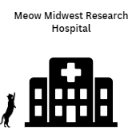
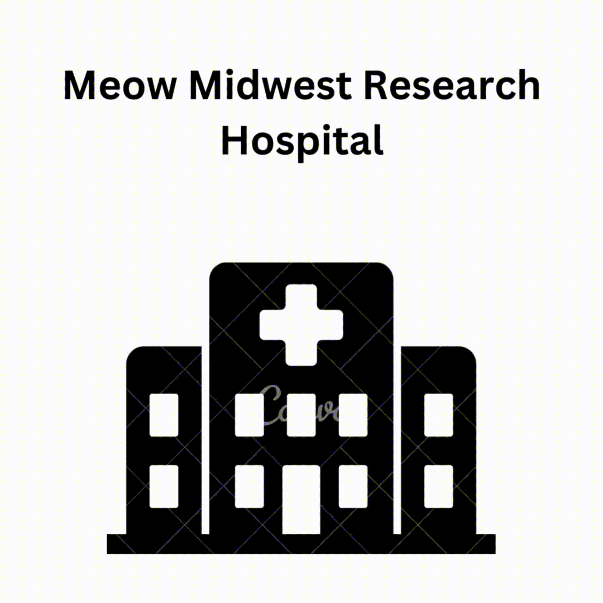

 
  

<h1 align="center"> Diabetis Predictor </h1>
<h3 align="center"> Python Developer Capstone 1</h3>
<h5 align="center"> Python Developer Career Training Course <a href="https://www.concordia.ca/](https://www.nwmissouri.edu/pdcenter/courses/python-developer.htm">Northwest Missouri State University</a> (Summer 2024) </h5>

 

I have developed a diabetis detector program in Python which classifies given emails as spam or ham using Multi-class classfication models.

<h2> : References</h2>
<ul>
  <li>
Mohammad Amin Shamshiri, Design Inspiration 

      
Available: https://raw.githubusercontent.com/yourexodus/Spam-Detector/master/README.md

  </li>
  <li>
 

      
Available:  

  </li>
  <li>
Gemini, Cat Images. [Online].

      
Available:  https://gemini.google.com/app/6bc72f678cfc0140 

  </li>
  <li>
Canva, 'Designed gif file'. [Online].

      
Available: https://www.canva.com/design/DAGLuuM3ZFw/T0YXntR7e4ji-2wUPw-zYw/edit 

  </li>
  <li>
 

      
 

  </li>
  <li>
 

      
 

  </li>
</ul>
